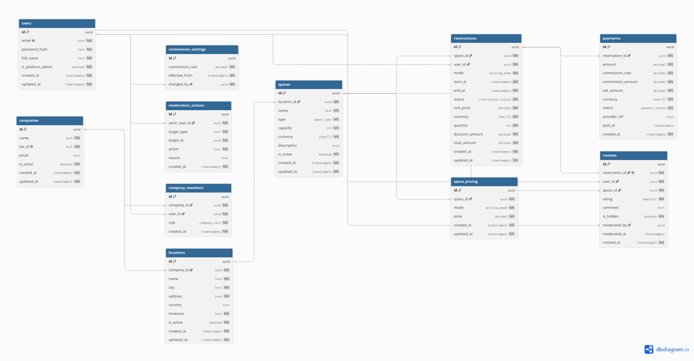

# Prueba 3 — Diseño de Sistema

**Plataforma de reservas para espacios de coworking**
Nicolás Martínez · Wind Consulting · 2026

---

## Cómo encaré esta prueba

Antes de tirar tablas y flechas quiero dejar claro el criterio con el que trabajé, porque
al final eso es lo que se está evaluando acá, no la cantidad de entidades.

El brief es deliberadamente ambiguo, así que en vez de inventar features me até a lo que el
negocio realmente dice: empresas que publican sedes y espacios, usuarios que buscan y
reservan pagando en línea, una comisión del 10% para la plataforma, reportes mensuales para
las empresas y reseñas de los usuarios. Cada decisión de diseño la tomé preguntándome dos
cosas: *¿esto se sostiene si el sistema crece?* y *¿el modelo dice lo mismo que las
historias?*. Cuando algo no cerraba, preferí anotarlo como decisión consciente antes que
esconderlo.

El documento tiene tres partes: las historias de usuario, el modelo de datos con la
justificación de cada decisión, y un bonus de cómo lo mapearía a Clean Architecture. Al
final agregué una sección con lo que dejé fuera de alcance y por qué; marcar los límites de
un diseño me parece más útil que fingir que cubre todo.

---

## Parte 1 — Historias de usuario

Formato `Como [rol] quiero [acción] para [beneficio]`, con mínimo 3 criterios de aceptación,
estimación de complejidad y dependencias. Cubrí más del mínimo pedido de forma intencional, para que
el modelo de la Parte 2 tenga de dónde agarrarse: **Operador 5 · Reservante 6 · Admin 3 =
14 historias**.

### Operador de espacio

#### HU-OP-01 · Registrar mi empresa
> Como **operador de espacio** quiero **registrar mi empresa en la plataforma** para
> **poder ofrecer mis espacios de coworking a los usuarios**.

**Criterios de aceptación:**
- El nombre y el identificador fiscal de la empresa son obligatorios y el fiscal no puede repetirse.
- Quien registra la empresa queda vinculado a ella como miembro con rol `owner`.
- Una empresa recién creada queda activa y lista para dar de alta sedes.

**Complejidad:** Media · **Dependencias:** necesito una cuenta de usuario activa (HU-US-01).

#### HU-OP-02 · Crear una sede
> Como **operador de espacio** quiero **dar de alta una sede en una ciudad** para
> **organizar mis espacios por ubicación física**.

**Criterios de aceptación:**
- Solo un miembro de la empresa puede crear sedes para esa empresa.
- La sede exige ciudad y dirección; guardo también su zona horaria para los reportes locales.
- Una empresa puede tener varias sedes en distintas ciudades.

**Complejidad:** Baja · **Dependencias:** HU-OP-01.

#### HU-OP-03 · Publicar un espacio
> Como **operador de espacio** quiero **crear un espacio (escritorio, sala u oficina) dentro
> de una sede** para **ponerlo disponible para reserva**.

**Criterios de aceptación:**
- El espacio pertenece a una sede existente de mi empresa.
- El tipo es uno de: escritorio individual, sala de reuniones u oficina privada.
- Un espacio inactivo no aparece en las búsquedas de los usuarios.

**Complejidad:** Media · **Dependencias:** HU-OP-02.

#### HU-OP-04 · Configurar precios por modalidad
> Como **operador de espacio** quiero **definir el precio por hora, por día y por mes de un
> espacio** para **cobrar según la modalidad que elija el usuario**.

**Criterios de aceptación:**
- Cada espacio tiene a lo sumo un precio por modalidad, y las modalidades de un mismo espacio comparten moneda.
- El precio debe ser mayor a 0.
- No se puede reservar en una modalidad que no tenga precio configurado.

**Complejidad:** Media · **Dependencias:** HU-OP-03.

#### HU-OP-05 · Ver mi reporte mensual
> Como **operador de espacio** quiero **ver un reporte mensual de ingresos netos y ocupación
> de mis espacios** para **evaluar cómo va mi negocio**.

**Criterios de aceptación:**
- El reporte muestra ingreso bruto, comisión descontada e ingreso neto del mes elegido.
- La ocupación se calcula sobre las reservas confirmadas y completadas del período (definición en la nota de diseño más abajo).
- Solo veo datos de las empresas a las que pertenezco, nunca de otras.

**Complejidad:** Alta · **Dependencias:** HU-US-04, HU-AD-01.

### Usuario reservante

#### HU-US-01 · Registrarme e iniciar sesión
> Como **usuario reservante** quiero **registrarme con email y contraseña** para
> **acceder a la plataforma y gestionar mis reservas**.

**Criterios de aceptación:**
- El sistema valida que el email no esté registrado antes.
- La contraseña debe tener mínimo 8 caracteres y al menos un número.
- La contraseña se guarda con hash, nunca en texto plano.

**Complejidad:** Media · **Dependencias:** ninguna.

#### HU-US-02 · Buscar espacios disponibles
> Como **usuario reservante** quiero **buscar espacios por ciudad, tipo y rango de fechas**
> para **encontrar un lugar libre que me sirva**.

**Criterios de aceptación:**
- Solo aparecen espacios activos y sin reservas que se solapen con el rango que pedí.
- Puedo filtrar por ciudad y por tipo al mismo tiempo.
- Cada resultado muestra el precio de la modalidad y la calificación promedio del espacio.

**Complejidad:** Alta · **Dependencias:** HU-OP-03, HU-OP-04.

#### HU-US-03 · Ver el detalle de un espacio
> Como **usuario reservante** quiero **ver el detalle y la disponibilidad de un espacio** para
> **decidir si lo reservo**.

**Criterios de aceptación:**
- El detalle muestra tipo, capacidad, precios por modalidad y las reseñas visibles.
- Se ve claramente qué rangos de fecha ya están ocupados.
- Si el espacio está inactivo, el detalle no es accesible públicamente.

**Complejidad:** Media · **Dependencias:** HU-US-02.

#### HU-US-04 · Reservar y pagar en línea
> Como **usuario reservante** quiero **reservar un espacio pagando en línea** para
> **asegurar mi lugar en las fechas elegidas**.

**Criterios de aceptación:**
- Antes de confirmar el pago, el sistema valida que el espacio esté libre en el rango (sin solapamientos).
- El total se calcula con el precio de la modalidad vigente al momento de reservar, y ese precio queda congelado en la reserva.
- El pago registra la comisión de la plataforma y el ingreso neto de la empresa; la reserva pasa a `confirmed` solo si el pago fue exitoso.

**Complejidad:** Alta · **Dependencias:** HU-US-03, HU-OP-04, HU-AD-01.

#### HU-US-05 · Cancelar mi reserva
> Como **usuario reservante** quiero **cancelar una reserva** para
> **liberar el espacio si me cambian los planes**.

**Criterios de aceptación:**
- Solo el dueño de la reserva puede cancelarla.
- Solo aplica si la reserva está en `pending` o `confirmed`, nunca si ya está `completed`.
- Al cancelar, el espacio vuelve a quedar disponible en ese rango.

**Complejidad:** Media · **Dependencias:** HU-US-04.

#### HU-US-06 · Dejar una reseña
> Como **usuario reservante** quiero **calificar y reseñar un espacio que usé** para
> **compartir mi experiencia con otros usuarios**.

**Criterios de aceptación:**
- Solo puedo reseñar una reserva `completed`, y solo si esa reserva es mía.
- La calificación es un entero de 1 a 5.
- Cada reserva admite una sola reseña.

**Complejidad:** Media · **Dependencias:** HU-US-04.

### Administrador de plataforma

#### HU-AD-01 · Configurar la comisión
> Como **administrador de plataforma** quiero **configurar el porcentaje de comisión** para
> **cobrar por cada reserva**.

**Criterios de aceptación:**
- La comisión vigente es la última fila de `commission_settings` (tabla append-only), por defecto 10%.
- Cada cambio queda registrado con el admin que lo hizo y desde cuándo aplica; los valores no se sobrescriben.
- Las reservas ya pagadas conservan su tasa como snapshot en `payments`; el histórico financiero no se toca.

**Complejidad:** Media · **Dependencias:** ninguna.

#### HU-AD-02 · Ver reportes globales
> Como **administrador de plataforma** quiero **ver reportes globales de reservas, ingresos y
> comisiones** para **monitorear la salud del negocio**.

**Criterios de aceptación:**
- El reporte agrega ingreso bruto, comisión cobrada y cantidad de reservas por período.
- Puedo segmentar por empresa y por ciudad.
- Los números reflejan solo pagos efectivamente realizados.

**Complejidad:** Alta · **Dependencias:** HU-US-04, HU-AD-01.

#### HU-AD-03 · Moderar reseñas y disputas
> Como **administrador de plataforma** quiero **ocultar reseñas que violen las políticas y
> marcar reservas en disputa** para **mantener la calidad y la confianza de la plataforma**.

**Criterios de aceptación:**
- Puedo ocultar una reseña; queda registrado quién la ocultó y cuándo.
- Puedo marcar una reserva como en disputa para revisión.
- Toda acción de moderación queda en una bitácora con el administrador que la hizo (ver tabla `moderation_actions`).

**Complejidad:** Media · **Dependencias:** HU-US-06.

> **Nota de diseño:** esta historia necesita un rastro de auditoría, así que la respaldo con la
> tabla `moderation_actions` (quién moderó qué y cuándo). Sin esa tabla, el criterio de
> "registrar toda acción de moderación" no sería implementable.

---

## Parte 2 — Modelo de base de datos

### Decisiones de diseño transversales

Antes del SQL, las cuatro decisiones grandes y por qué las tomé. Traté de ser honesto con
los tradeoffs en vez de vender solo el lado bueno.

**Llaves primarias: UUID (con `gen_random_uuid`, o sea v4).**
Me fui por UUID y no por `BIGSERIAL` porque esto es un SaaS multiempresa cuyos IDs se
exponen en la API y en URLs. Con enteros secuenciales estaría filtrando cuántos usuarios o
reservas tengo, y cualquiera podría iterar IDs; con UUID eso no pasa, y además puedo generar
IDs desde varios lados sin coordinar una secuencia central. Ahora, siendo honesto: uso
`gen_random_uuid()`, que es **UUIDv4 (aleatorio)**. Su costo real es la localidad de índice
— al ser random, los inserts se dispersan por el B-tree y fragmentan más que un entero. Lo
asumo a cambio de cero dependencias. Si el volumen de escritura lo pidiera, el siguiente paso
natural sería **UUIDv7** (ordenado por tiempo), vía la extensión `pg_uuidv7` o la función
nativa `uuidv7()` de PostgreSQL 18; no lo puse por defecto para no depender de una extensión
en una prueba, pero sé exactamente cuál es la evolución.

**Fechas y horas: `TIMESTAMPTZ` siempre.**
Las sedes están en distintas ciudades y potencialmente países. Guardar el instante en UTC
me quita toda la ambigüedad de zona horaria y horario de verano: "10:00 en Bogotá" y "10:00
en Ciudad de México" son instantes distintos, y si comparo solapamientos o sumo ingresos por
mes con un `TIMESTAMP` sin zona, tarde o temprano me equivoco. La zona horaria "de
presentación" de cada sede la guardo aparte en `locations.timezone`, para los reportes que el
operador quiere ver en su hora local.

**Estado de reserva: `ENUM` nativo.**
`pending / confirmed / cancelled / completed` es un conjunto chico, estable y controlado por
una máquina de estados en la aplicación. Un ENUM me da chequeo de tipo, es compacto y no
necesita join. El costo es que sumar un valor pide un `ALTER TYPE` (una migración) y que no
puedo colgarle metadata. Como estos cuatro estados no van a crecer ni necesitan etiquetas
traducibles, el ENUM gana. Si mañana el negocio quisiera estados administrables con metadata,
ahí sí me mudaría a una tabla de catálogo.

**Comisión: se guarda en `payments` al momento del pago, no se calcula al vuelo.**
La tasa de comisión es un parámetro que cambia (hoy 10%, mañana 8%). Un registro financiero
tiene que ser inmutable y reflejar la tasa que estaba vigente cuando se cobró. Si la calculara
dinámicamente, cambiar la comisión reescribiría retroactivamente todos los reportes históricos
y me rompería la conciliación contable. Por eso congelo `commission_rate` y `commission_amount`
como snapshot. El mismo criterio aplica a `reservations.unit_price` y a la moneda: congelo el
precio y la moneda vigentes al reservar, para que un cambio de tarifa después no toque reservas
viejas.

### Definición de tablas (SQL)

```sql
-- Extensiones
CREATE EXTENSION IF NOT EXISTS pgcrypto;    -- gen_random_uuid()
CREATE EXTENSION IF NOT EXISTS btree_gist;  -- EXCLUDE constraint anti-solapamiento

-- Tipos ENUM
CREATE TYPE space_type         AS ENUM ('individual_desk', 'meeting_room', 'private_office');
CREATE TYPE pricing_mode       AS ENUM ('hour', 'day', 'month');
CREATE TYPE reservation_status AS ENUM ('pending', 'confirmed', 'cancelled', 'completed');
CREATE TYPE payment_status     AS ENUM ('pending', 'paid', 'refunded', 'failed');
CREATE TYPE company_role       AS ENUM ('owner', 'manager', 'staff');

-- Función para mantener updated_at automáticamente
CREATE OR REPLACE FUNCTION set_updated_at() RETURNS trigger AS $$
BEGIN
    NEW.updated_at = now();
    RETURN NEW;
END;
$$ LANGUAGE plpgsql;

-- Identidad / autenticación (una sola tabla; ver P1)
CREATE TABLE users (
    id                UUID PRIMARY KEY DEFAULT gen_random_uuid(),
    email             TEXT NOT NULL UNIQUE,
    password_hash     TEXT NOT NULL,
    full_name         TEXT NOT NULL,
    is_platform_admin BOOLEAN NOT NULL DEFAULT FALSE,  -- rol global de admin de plataforma
    created_at        TIMESTAMPTZ NOT NULL DEFAULT now(),
    updated_at        TIMESTAMPTZ NOT NULL DEFAULT now()
);
CREATE TRIGGER trg_users_updated BEFORE UPDATE ON users
    FOR EACH ROW EXECUTE FUNCTION set_updated_at();

-- Comisión de la plataforma (HU-AD-01). Tabla APPEND-ONLY: cada cambio es una fila nueva,
-- así queda el rastro de quién la cambió y desde cuándo. La comisión vigente es la fila con
-- effective_from más reciente; el histórico financiero real vive en payments (snapshot).
CREATE TABLE commission_settings (
    id              UUID PRIMARY KEY DEFAULT gen_random_uuid(),
    commission_rate NUMERIC(5,4) NOT NULL CHECK (commission_rate >= 0),
    effective_from  TIMESTAMPTZ NOT NULL DEFAULT now(),
    changed_by      UUID NOT NULL REFERENCES users(id)  -- admin que hizo el cambio
);

-- Empresas operadoras
CREATE TABLE companies (
    id          UUID PRIMARY KEY DEFAULT gen_random_uuid(),
    name        TEXT NOT NULL,
    tax_id      TEXT NOT NULL UNIQUE,          -- datos fiscales obligatorios (HU-OP-01)
    email       TEXT,
    is_active   BOOLEAN NOT NULL DEFAULT TRUE, -- soft-delete: nunca borro una empresa con histórico
    created_at  TIMESTAMPTZ NOT NULL DEFAULT now(),
    updated_at  TIMESTAMPTZ NOT NULL DEFAULT now()
);
CREATE TRIGGER trg_companies_updated BEFORE UPDATE ON companies
    FOR EACH ROW EXECUTE FUNCTION set_updated_at();

-- Vínculo usuario <-> empresa (rol contextual "operador"; ver P1)
CREATE TABLE company_members (
    id          UUID PRIMARY KEY DEFAULT gen_random_uuid(),
    company_id  UUID NOT NULL REFERENCES companies(id) ON DELETE CASCADE,
    user_id     UUID NOT NULL REFERENCES users(id)     ON DELETE CASCADE,
    role        company_role NOT NULL DEFAULT 'staff', -- mínimo privilegio por defecto
    created_at  TIMESTAMPTZ NOT NULL DEFAULT now(),
    UNIQUE (company_id, user_id)
);
CREATE INDEX idx_company_members_user ON company_members (user_id); -- "empresas de un usuario"

-- Sedes físicas
CREATE TABLE locations (
    id          UUID PRIMARY KEY DEFAULT gen_random_uuid(),
    company_id  UUID NOT NULL REFERENCES companies(id) ON DELETE CASCADE,
    name        TEXT NOT NULL,
    city        TEXT NOT NULL,
    address     TEXT NOT NULL,
    country     TEXT,
    timezone    TEXT NOT NULL, -- IANA tz de la sede (ej. 'America/Bogota') para reportes locales
    is_active   BOOLEAN NOT NULL DEFAULT TRUE,
    created_at  TIMESTAMPTZ NOT NULL DEFAULT now(),
    updated_at  TIMESTAMPTZ NOT NULL DEFAULT now()
);
CREATE INDEX idx_locations_city ON locations (city);
CREATE TRIGGER trg_locations_updated BEFORE UPDATE ON locations
    FOR EACH ROW EXECUTE FUNCTION set_updated_at();

-- Espacios
CREATE TABLE spaces (
    id          UUID PRIMARY KEY DEFAULT gen_random_uuid(),
    location_id UUID NOT NULL REFERENCES locations(id) ON DELETE CASCADE,
    name        TEXT NOT NULL,
    type        space_type NOT NULL,
    capacity    INT NOT NULL CHECK (capacity > 0),  -- aforo de personas, no disponibilidad temporal
    currency    CHAR(3) NOT NULL DEFAULT 'USD',     -- una sola moneda por espacio (HU-OP-04)
    description TEXT,
    is_active   BOOLEAN NOT NULL DEFAULT TRUE,
    created_at  TIMESTAMPTZ NOT NULL DEFAULT now(),
    updated_at  TIMESTAMPTZ NOT NULL DEFAULT now()
);
CREATE INDEX idx_spaces_location ON spaces (location_id);
CREATE INDEX idx_spaces_type     ON spaces (type);
CREATE TRIGGER trg_spaces_updated BEFORE UPDATE ON spaces
    FOR EACH ROW EXECUTE FUNCTION set_updated_at();

-- Precio por modalidad
CREATE TABLE space_pricing (
    id          UUID PRIMARY KEY DEFAULT gen_random_uuid(),
    space_id    UUID NOT NULL REFERENCES spaces(id) ON DELETE CASCADE,
    mode        pricing_mode NOT NULL,
    price       NUMERIC(12,2) NOT NULL CHECK (price > 0),  -- moneda heredada de spaces.currency
    created_at  TIMESTAMPTZ NOT NULL DEFAULT now(),
    updated_at  TIMESTAMPTZ NOT NULL DEFAULT now(),
    UNIQUE (space_id, mode)     -- un precio por modalidad por espacio
);
CREATE TRIGGER trg_space_pricing_updated BEFORE UPDATE ON space_pricing
    FOR EACH ROW EXECUTE FUNCTION set_updated_at();

-- Reservas
CREATE TABLE reservations (
    id              UUID PRIMARY KEY DEFAULT gen_random_uuid(),
    space_id        UUID NOT NULL REFERENCES spaces(id) ON DELETE RESTRICT, -- protege el histórico
    user_id         UUID NOT NULL REFERENCES users(id)  ON DELETE RESTRICT,
    mode            pricing_mode NOT NULL,
    start_at        TIMESTAMPTZ NOT NULL,
    end_at          TIMESTAMPTZ NOT NULL,
    status          reservation_status NOT NULL DEFAULT 'pending',
    unit_price      NUMERIC(12,2) NOT NULL,   -- snapshot del precio de la modalidad al reservar
    currency        CHAR(3) NOT NULL,         -- snapshot de la moneda junto al precio
    quantity        INT NOT NULL CHECK (quantity > 0), -- nº de unidades (horas/días/meses)
    discount_amount NUMERIC(12,2) NOT NULL DEFAULT 0 CHECK (discount_amount >= 0),
    total_amount    NUMERIC(12,2) NOT NULL CHECK (total_amount >= 0),
    created_at      TIMESTAMPTZ NOT NULL DEFAULT now(),
    updated_at      TIMESTAMPTZ NOT NULL DEFAULT now(),
    CHECK (end_at > start_at),
    CHECK (total_amount = unit_price * quantity - discount_amount),  -- el dinero tiene que cuadrar
    UNIQUE (id, user_id)  -- necesario para la FK compuesta de reviews (ver P4)
);

-- Anti-solapamiento a nivel de BD (ver P3): ninguna reserva activa puede pisar
-- el rango de otra para el mismo espacio.
ALTER TABLE reservations
    ADD CONSTRAINT no_overlapping_reservations
    EXCLUDE USING gist (
        space_id WITH =,
        tstzrange(start_at, end_at) WITH &&
    ) WHERE (status IN ('pending', 'confirmed', 'completed'));

CREATE INDEX idx_reservations_user     ON reservations (user_id);
CREATE INDEX idx_reservations_space    ON reservations (space_id);
CREATE INDEX idx_reservations_start_at ON reservations (start_at); -- reportes por período

CREATE TRIGGER trg_reservations_updated BEFORE UPDATE ON reservations
    FOR EACH ROW EXECUTE FUNCTION set_updated_at();

-- Pagos: varios intentos posibles por reserva, un solo pago EXITOSO (ver índice parcial abajo).
-- Sin ON DELETE CASCADE a propósito: el ledger financiero es inmutable.
CREATE TABLE payments (
    id                UUID PRIMARY KEY DEFAULT gen_random_uuid(),
    reservation_id    UUID NOT NULL REFERENCES reservations(id) ON DELETE RESTRICT,
    amount            NUMERIC(12,2) NOT NULL CHECK (amount >= 0),         -- lo que paga el usuario
    commission_rate   NUMERIC(5,4)  NOT NULL CHECK (commission_rate >= 0),-- snapshot ej. 0.1000
    commission_amount NUMERIC(12,2) NOT NULL CHECK (commission_amount >= 0),
    net_amount        NUMERIC(12,2) NOT NULL CHECK (net_amount >= 0),     -- ingreso de la empresa
    currency          CHAR(3) NOT NULL,
    status            payment_status NOT NULL DEFAULT 'pending',
    provider_ref      TEXT,   -- referencia del proveedor de pagos (detalle de infraestructura)
    paid_at           TIMESTAMPTZ,
    created_at        TIMESTAMPTZ NOT NULL DEFAULT now(),
    CHECK (net_amount = amount - commission_amount)  -- el dinero tiene que cuadrar
);
CREATE INDEX idx_payments_paid_at ON payments (paid_at);
CREATE INDEX idx_payments_status  ON payments (status);
-- Un solo pago EXITOSO por reserva, pero permitiendo reintentos tras un intento fallido.
CREATE UNIQUE INDEX uq_payment_paid ON payments (reservation_id) WHERE status = 'paid';

-- Reseñas (una por reserva completada, solo del dueño de la reserva; ver P4)
CREATE TABLE reviews (
    id             UUID PRIMARY KEY DEFAULT gen_random_uuid(),
    reservation_id UUID NOT NULL UNIQUE,
    user_id        UUID NOT NULL,
    space_id       UUID NOT NULL REFERENCES spaces(id) ON DELETE CASCADE,
    rating         SMALLINT NOT NULL CHECK (rating BETWEEN 1 AND 5),
    comment        TEXT,
    is_hidden      BOOLEAN NOT NULL DEFAULT FALSE,       -- moderación (HU-AD-03)
    moderated_by   UUID REFERENCES users(id),
    moderated_at   TIMESTAMPTZ,
    created_at     TIMESTAMPTZ NOT NULL DEFAULT now(),
    -- FK compuesta: garantiza a nivel de BD que quien reseña es el dueño de la reserva
    FOREIGN KEY (reservation_id, user_id)
        REFERENCES reservations (id, user_id) ON DELETE CASCADE
);
CREATE INDEX idx_reviews_space ON reviews (space_id);

-- Bitácora de moderación (HU-AD-03): quién hizo qué acción y sobre qué.
CREATE TABLE moderation_actions (
    id             UUID PRIMARY KEY DEFAULT gen_random_uuid(),
    actor_user_id  UUID NOT NULL REFERENCES users(id) ON DELETE RESTRICT,
    target_type    TEXT NOT NULL CHECK (target_type IN ('review', 'reservation')),
    target_id      UUID NOT NULL,  -- referencia polimórfica: sin FK a propósito, se valida por target_type en la app
    action         TEXT NOT NULL,   -- ej. 'hide_review', 'flag_dispute'
    reason         TEXT,
    created_at     TIMESTAMPTZ NOT NULL DEFAULT now()
);
CREATE INDEX idx_moderation_target ON moderation_actions (target_type, target_id);
```

**Sobre la coherencia entre `quantity`, `mode` y el rango de fechas:** el `EXCLUDE` bloquea
el rango real (`start_at`/`end_at`), pero nada garantiza a nivel de columna que `quantity`
coincida con ese rango — se podría bloquear un espacio 10 días y facturar 1. No lo resolví
con un `CHECK` porque para `month` la duración no es fija (28–31 días). Lo cierro con un
trigger `BEFORE INSERT/UPDATE` que valida que la duración del rango corresponda a
`quantity` según `mode`, y lo dejo anotado como parte de la lógica de creación de la reserva.

### Diagrama ERD (dbdiagram.io)



- **Diagrama interactivo:** https://dbdiagram.io/d/Prueba3-6a5ec068067336e1deb86552
- **Versión vectorial (SVG):** [`assets/erd.svg`](assets/erd.svg)

El DSL de origen está abajo (por si quieren regenerarlo). Una aclaración honesta: dbdiagram no
representa FK compuestas, así que la relación `reviews → reservations` aparece como FK simple
sobre `reservation_id`; en el SQL real es compuesta `(reservation_id, user_id)`.

```dbml
Table users {
  id uuid [pk]
  email text [unique, not null]
  password_hash text [not null]
  full_name text [not null]
  is_platform_admin boolean [not null, default: false]
  created_at timestamptz [not null]
  updated_at timestamptz [not null]
}

Table commission_settings {
  id uuid [pk]
  commission_rate decimal [not null]
  effective_from timestamptz [not null]
  changed_by uuid [ref: > users.id, not null]
}

Table companies {
  id uuid [pk]
  name text [not null]
  tax_id text [unique, not null]
  email text
  is_active boolean [not null, default: true]
  created_at timestamptz [not null]
  updated_at timestamptz [not null]
}

Table company_members {
  id uuid [pk]
  company_id uuid [ref: > companies.id, not null]
  user_id uuid [ref: > users.id, not null]
  role company_role [not null]
  created_at timestamptz [not null]
  indexes { (company_id, user_id) [unique] }
}

Table locations {
  id uuid [pk]
  company_id uuid [ref: > companies.id, not null]
  name text [not null]
  city text [not null]
  address text [not null]
  country text
  timezone text [not null]
  is_active boolean [not null, default: true]
  created_at timestamptz [not null]
  updated_at timestamptz [not null]
}

Table spaces {
  id uuid [pk]
  location_id uuid [ref: > locations.id, not null]
  name text [not null]
  type space_type [not null]
  capacity int [not null]
  currency char(3) [not null]
  description text
  is_active boolean [not null, default: true]
  created_at timestamptz [not null]
  updated_at timestamptz [not null]
}

Table space_pricing {
  id uuid [pk]
  space_id uuid [ref: > spaces.id, not null]
  mode pricing_mode [not null]
  price decimal [not null]
  created_at timestamptz [not null]
  updated_at timestamptz [not null]
  indexes { (space_id, mode) [unique] }
}

Table reservations {
  id uuid [pk]
  space_id uuid [ref: > spaces.id, not null]
  user_id uuid [ref: > users.id, not null]
  mode pricing_mode [not null]
  start_at timestamptz [not null]
  end_at timestamptz [not null]
  status reservation_status [not null]
  unit_price decimal [not null]
  currency char(3) [not null]
  quantity int [not null]
  discount_amount decimal [not null]
  total_amount decimal [not null]
  created_at timestamptz [not null]
  updated_at timestamptz [not null]
}

Table payments {
  id uuid [pk]
  reservation_id uuid [ref: > reservations.id, not null]
  amount decimal [not null]
  commission_rate decimal [not null]
  commission_amount decimal [not null]
  net_amount decimal [not null]
  currency char(3) [not null]
  status payment_status [not null]
  provider_ref text
  paid_at timestamptz
  created_at timestamptz [not null]
}

Table reviews {
  id uuid [pk]
  reservation_id uuid [ref: - reservations.id, unique, not null]
  user_id uuid [ref: > users.id, not null]
  space_id uuid [ref: > spaces.id, not null]
  rating smallint [not null]
  comment text
  is_hidden boolean [not null, default: false]
  moderated_by uuid [ref: > users.id]
  moderated_at timestamptz
  created_at timestamptz [not null]
}

Table moderation_actions {
  id uuid [pk]
  actor_user_id uuid [ref: > users.id, not null]
  target_type text [not null]
  target_id uuid [not null]
  action text [not null]
  reason text
  created_at timestamptz [not null]
}
```

> `space_type`, `pricing_mode`, `reservation_status`, `payment_status` y `company_role` son
> tipos ENUM nativos de PostgreSQL, no tablas.

### Preguntas de diseño P1–P4

**P1 — Un mismo usuario puede ser operador y reservante a la vez. ¿Cómo lo manejo?**
Una sola tabla `users` para identidad y login, **sin columna `role` global**. Ser reservante
es implícito: cualquier usuario autenticado puede reservar. Ser operador es un rol
*contextual*, modelado como una fila en `company_members` (usuario ↔ empresa). Así el mismo
registro puede ser las dos cosas al tiempo, sin duplicar identidad. Descarté la columna `role`
porque fuerza un único rol y rompe la doble capacidad, y descarté tablas separadas
`operators`/`reservers` porque duplicarían la identidad y el login (un usuario dual necesitaría
dos filas y dos contraseñas). Como bonus, `company_members` soporta que una empresa tenga
varios operadores con distinto nivel (`owner/manager/staff`).

**P2 — Si mañana hay descuentos por volumen (5 días = 10% off), ¿qué cambio sin romper nada?**
Agrego una tabla nueva `pricing_rules` (por espacio o empresa: `min_quantity`, `discount_pct`,
vigencia) que se evalúa al crear la reserva. El resultado ya tiene dónde guardarse: la columna
`reservations.discount_amount` (que dejé lista con default 0) guarda el descuento aplicado como
snapshot, y `total_amount` lo refleja. Es un cambio **puramente aditivo**: no toco ninguna
columna ni tabla existente, solo sumo la tabla de reglas. La clave es que el descuento se
congela en la reserva, no se recalcula, por la misma razón que el precio: un cambio de reglas
después no debe alterar reservas viejas.

**P3 — ¿Cómo evito dos reservas solapadas para el mismo espacio en las mismas fechas?**
En **los dos niveles**, y la fuente de verdad es la base de datos. A nivel de BD uso un
constraint `EXCLUDE USING gist` (`space_id WITH =`, `tstzrange(start_at, end_at) WITH &&`,
filtrado por estados activos): garantiza que nunca existan dos reservas activas que se pisen,
incluso con dos requests concurrentes peleando por el mismo horario — que es justo donde un
chequeo hecho solo en la app se cae por race condition. A nivel de aplicación igual hago la
verificación previa de disponibilidad, pero por UX: dar feedback rápido y un error lindo, todo
dentro de la transacción de creación. La app mejora la experiencia; la BD garantiza la
integridad. Dejo `completed` dentro del filtro adrede, porque sacarlo permitiría re-reservar
un rango histórico ya consumido.

Un cabo que hay que atar: como las reservas `pending` también bloquean el rango (justo para no
perder la carrera del checkout), un usuario que abandona el pago dejaría el espacio bloqueado
sin límite. Lo resuelvo con un job que expira las `pending` sin pagar a los N minutos y las
pasa a `cancelled`, liberando el slot. Su gemelo del otro lado: otro job pasa las `confirmed`
a `completed` una vez que `end_at` ya pasó, y esa transición es la que habilita las reseñas —
sin ella, `completed` sería un estado inalcanzable.

**P4 — Una reseña por reserva completada, y solo el autor de la reserva puede escribirla.**
Tres candados:
1. `reviews.reservation_id UNIQUE` → una sola reseña por reserva.
2. **FK compuesta** `reviews(reservation_id, user_id) → reservations(id, user_id)`, apoyada en
   el `UNIQUE(id, user_id)` de `reservations`. Esto garantiza a nivel de BD que el `user_id`
   de la reseña es el mismo que hizo la reserva — no es cosmético, es enforcement real. (El
   `UNIQUE(id, user_id)` parece redundante con el PK, pero no lo es: PostgreSQL exige un
   constraint único que cubra exactamente las columnas referenciadas para poder soportar la FK
   compuesta.)
3. La condición "solo reservas `completed`" la valido con un trigger (además del caso de uso),
   porque depende del estado de la reserva y ahí un `CHECK` no alcanza.
   Más el `CHECK (rating BETWEEN 1 AND 5)`.

---

## Parte 3 — Bonus: mapeo a Clean Architecture

**¿En qué capa vive cada tabla?** En ninguna, y esa es la idea. Las tablas son artefactos de
la **capa de repositorio/adaptadores** (persistencia). El **dominio** no conoce tablas: modela
entidades con sus invariantes —`User`, `Company`, `Location`, `Space`, `Pricing`,
`Reservation`, `Payment`, `Review`— y define las *interfaces* de repositorio. La capa de
repositorio traduce esas entidades a filas. Los ENUM, triggers y constraints son detalles de
infraestructura que *respaldan* invariantes que el dominio también expresa en código (no
delego la regla de negocio a la BD, la duplico como red de seguridad).

**¿Qué historias son use cases individuales y cuáles se agrupan?** Van solos los que tienen
peso transaccional o de negocio propio: `CreateReservation` (HU-US-04, que envuelve validar
solapamiento + congelar precio + cobrar + calcular comisión en una transacción),
`SearchAvailableSpaces` (HU-US-02) y `GenerateMonthlyReport` (HU-OP-05). Se agrupan los de
gestión: el CRUD de sedes/espacios/precios (HU-OP-02/03/04) cae natural en un módulo
`SpaceManagement`, y registro/login (HU-US-01) en `Auth`.

**¿Alguna entidad NO debería existir en el dominio?** Sí. `company_members` es una tabla
puente: en el dominio no es una entidad con identidad propia, es la expresión de una relación
("este usuario es operador de esta empresa"), que modelaría como comportamiento, no como
entidad. Lo mismo `moderation_actions` (auditoría, vive en las capas externas) y los campos de
infraestructura como `payments.provider_ref`.

---

## Lo que dejé fuera de alcance (y por qué)

Estas cosas las vi y decidí conscientemente no meterlas en esta prueba. Prefiero nombrarlas a
que parezca que no las consideré:

- **Aislamiento multiempresa a nivel de BD (RLS).** HU-OP-05 exige que un operador nunca vea
  datos de otra empresa. Lo resuelvo en la capa de aplicación (filtrando por las membresías del
  usuario). A nivel productivo endurecería esto con Row-Level Security de PostgreSQL, pero lo
  dejo como decisión documentada, no como olvido.
- **Crecimiento del índice del `EXCLUDE`.** Como `completed` nunca sale del filtro, el índice
  GiST acumula todo el histórico. A escala grande, cada reserva nueva se valida contra años de
  reservas viejas que ya no pueden solaparse con fechas futuras. La solución sería particionar
  por tiempo; no lo hago acá para no sobre-diseñar, pero sé que existe.
- **Definición fina de "ocupación" para el reporte.** La calcularía como
  (unidades reservadas confirmadas+completadas) ÷ (unidades disponibles del período) por
  espacio. Ojo que `spaces.capacity` es aforo de personas, no disponibilidad temporal — son dos
  métricas distintas y no las mezclo.
- **Borrado de usuario (GDPR).** Dejé `reservations.user_id` con `ON DELETE RESTRICT`, así que
  no se puede borrar un usuario con histórico. La estrategia correcta sería anonimizar en vez de
  borrar; lo dejo anotado.
- **Modelado fino de la pasarela de pago.** El índice parcial `UNIQUE (reservation_id) WHERE
  status='paid'` ya permite varios intentos y un solo pago exitoso. Lo que dejé afuera es la
  integración real con un proveedor (idempotency keys, webhooks de confirmación asíncrona,
  conciliación), que excede el brief.
- **Política de reembolsos.** `payment_status` ya contempla `refunded`, pero no definí las reglas
  (cuánto se devuelve según cuándo se cancela la reserva). Es una decisión de negocio: el esquema
  la soporta, la política la dejo fuera del alcance.
- **Consolidado multi-moneda en reportes.** Como la moneda es por espacio, una empresa puede
  facturar en varias (COP y USD). Los reportes agregan por moneda (`GROUP BY currency`); un total
  único consolidado necesitaría una tabla `exchange_rates` con fecha, que queda fuera del alcance.
